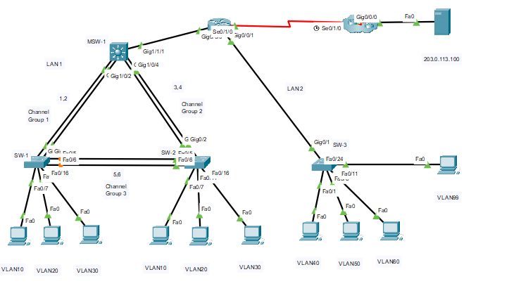

### objectives:
- Configuration of initial settings on a router.
- Configuration of initial settings on a switch, including SVI and SSH.
- Configuration of VLANs.
- Configuration of switchport VLAN membership.
- EtherChannel configuration.
- Troubleshooting VLANs.
- Configuration of static trunking and DTP.
- Configuration of routing between VLANs on a Layer 3 switch.
- Configuration of router-on-a-stick inter- VLAN routing on a router.
- Configure default gateways on hosts

c
## Part 1: Basic Router Configuration
### Step 1: Configure router RTR-1 with required settings

    - A console password
    - Remote access to the VTY lines.
    - A banner MOTD message.
    - The device hostname according to the value in the addressing table.
    - All clear text passwords should be encrypted.
    - Interface addressing on G0/0/0 and S0/1/0.
    - Interface descriptions on G0/0/0 and S0/1/0.

        Router(config)#hostname RTR-1
        RTR-1(config)#enable secret ccna@123
        RTR-1(config)#line console 0
        RTR-1(config-line)#password ccna@789
        RTR-1(config-line)#login
        RTR-1(config-line)#exit
        RTR-1(config)#line vty 0 15
        RTR-1(config-line)#password ccna@789
        RTR-1(config-line)#login
        RTR-1(config-line)#exit
        RTR-1(config)#banner motd # Selamat Datang!#
        RTR-1(config)#service password-encryption
        RTR-1(config)#interface g0/0/0
        RTR-1(config-if)#ip address 192.168.0.1 255.255.255.0
        RTR-1(config-if)#description Link to LAN 1
        RTR-1(config-if)#no shutdown
        RTR-1(config-if)#exit
        RTR-1(config)#interface s0/1/0
        RTR-1(config-if)#ip address 209.165.201.2 255.255.255.252
        RTR-1(config-if)#description Link to Internet
        RTR-1(config-if)#no shutdown

## Part 2: Basic Switch Configuration
### Step 1: Configure Remote Management Addressing

a. Configure SVI 99 on switch SW-3 with IP addressing       according to the Addressing Table

        W-4(config)#interface vlan 99
        SW-4(config-if)#ip address 192.168.99.18 255.255.255.240
        SW-4(config-if)#no shutdown
        SW-4(config-if)#exit
        SW-4(config)#ip default-gateway 192.168.99.17

### Step 2: Configure Secure Remote Access

On switch SW-3, configure SSH as follows:

- Username: admin password: C1sco123!
- Modulus bits 1024
- All VTY lines should accept SSH connections only
- Connections should require the previously configured username and password.
- IP domain name: acad.pt

        SW-3(config)#ip domain-name acad.pt
        SW-3(config)#crypto key generate rsa
                    How many bits in the modulus [512]: 1024
        SW-3(config)#username admin privilege 15 secret C1sco123!
        SW-3(config)#enable secret C1sco123!
        SW-3(config)#line vty 0 15
        SW-3(config-line)#transport input ssh
        SW-3(config-line)#login local
        SW-3(config-line)#exit
        SW-3(config)#ip ssh version 2

## Part 3: VLAN Configuration
### Step 1: Configure VLANs according to the VLAN table.
#### Vlan Table

#### MSW-1
        MSW-1(config)#vlan 10
        MSW-1(config-vlan)#name SALES
        MSW-1(config-vlan)#interface vlan 10
        MSW-1(config-if)#description SALES
        MSW-1(config-if)#ip address 192.168.10.1 255.255.255.0
        MSW-1(config-if)#exit
        MSW-1(config)#vlan 20
        MSW-1(config-vlan)#name ACCT
        MSW-1(config-vlan)#interface vlan 20
        MSW-1(config-if)#description ACCT
        MSW-1(config-if)#ip address 192.168.20.1 255.255.255.0
        MSW-1(config-if)#exit
        MSW-1(config)#vlan 30
        MSW-1(config-vlan)#name EXEC
        MSW-1(config-vlan)#interface vlan 30
        MSW-1(config-if)#description EXEC
        MSW-1(config-if)#ip address 192.168.30.1 255.255.255.0
        MSW-1(config-if)#exit
        MSW-1(config)#vlan 99
        MSW-1(config-vlan)#name ADMIN
        MSW-1(config-vlan)#interface vlan 99
        MSW-1(config-if)#description ADMIN
        MSW-1(config-if)#ip address 192.168.99.2 255.255.255.240
        MSW-1(config-if)#exit

#### SW-1
        SW-1(config)#vlan 10
        SW-1(config-vlan)#name SALES
        SW-1(config-vlan)#description SALES
        SW-1(config-vlan)#interface vlan 10
        SW-1(config-if)#description SALES
        SW-1(config-if)#exit
        SW-1(config)#vlan 20
        SW-1(config-vlan)#name ACCT
        SW-1(config-vlan)#interface vlan 20
        SW-1(config-if)#description ACCT
        SW-1(config-if)#exit
        SW-1(config)#vlan 30
        SW-1(config-vlan)#name EXEC
        SW-1(config-vlan)#interface vlan 30
        SW-1(config-if)#exit
#### SW-2
        SW-2(config)#vlan 10
        SW-2(config-vlan)#name SALES
        SW-2(config-vlan)#interface vlan 10
        SW-2(config-if)#
        %LINK-5-CHANGED: Interface Vlan10, changed state to up

        SW-2(config-if)#description SALES
        SW-2(config-if)#exit
        SW-2(config)#vlan 20
        SW-2(config-vlan)#name ACCT
        SW-2(config-vlan)#interface vlan 20
        SW-2(config-if)#
        %LINK-5-CHANGED: Interface Vlan20, changed state to up

        SW-2(config-if)#description ACCT
        SW-2(config-if)#exit
        SW-2(config)#vlan 30
        SW-2(config-vlan)#name EXEC
        SW-2(config-vlan)#interface vlan 30
        SW-2(config-if)#
        %LINK-5-CHANGED: Interface Vlan30, changed state to up
        SW-2(config-if)#description EXEC
        SW-2(config-if)#exit

#### SW -3

        SW-3(config)#vlan 40
        SW-3(config-vlan)#name FAC
        SW-3(config-vlan)#interface vlan 40
        SW-3(config-if)#
        %LINK-5-CHANGED: Interface Vlan40, changed state to up

        SW-3(config-if)#ip address 192.168.40.1 255.255.255.0
        SW-3(config-if)#description FAC
        SW-3(config-if)#exit
        SW-3(config)#vlan 50
        SW-3(config-vlan)#name FAB1
        SW-3(config-vlan)#interface vlan 50
        SW-3(config-if)#
        %LINK-5-CHANGED: Interface Vlan50, changed state to up

        SW-3(config-if)#description FAB1
        SW-3(config-if)#ip address 192.168.50.1 255.255.255.0
        SW-3(config-if)#exit
        SW-3(config)#vlan 60
        SW-3(config-vlan)#name FAB2
        SW-3(config-vlan)#interface vlan 60
        SW-3(config-if)#
        %LINK-5-CHANGED: Interface Vlan60, changed state to up

        SW-4(config-if)#ip address 192.168.60.1 255.255.255.0
        SW-3(config-if)#description FAB2
        SW-3(config-if)#exit
        SW-3(config)#vlan 99
        SW-3(config-vlan)#
        %LINK-5-CHANGED: Interface Vlan99, changed state to up

        SW-3(config-vlan)#name ADMIN
        SW-3(config-vlan)#interface vlan 99
        SW-3(config-if)#ip address 192.168.99.18 255.255.255.240
        SW-3(config-if)#description ADMIN 
        SW-3(config-if)#exit

### Step 2: Assign switch ports to VLANs
#### Port VLAN Table

#### SW-1
        SW-1(config)#interface range f0/7-10
        SW-1(config-if-range)#switchport mode access
        SW-(config-if-range)#switchport access vlan 10
        SW-1(config-if-range)#
        SW-1(config-if-range)#exit
        SW-1(config)#interface range f0/11-15
        SW-1(config-if-range)#switchport mode access
        SW-1(config-if-range)#switchport access vlan 20
        SW-1(config-if-range)#
        SW-1(config-if-range)#exit
        SW-1(config)#interface range f0/16-24
        SW-1(config-if-range)#switchport mode access
        SW-1(config-if-range)#switchport access vlan 30
        SW-1(config-if-range)

#### SW-2

        SW-2(config)#interface range f0/7-10
        SW-2(config-if-range)#switchport mode access
        SW-2(config-if-range)#switchport access vlan 10
        SW-2(config-if-range)#
        SW-2(config-if-range)#exit
        SW-2(config)#interface range f0/11-15
        SW-2(config-if-range)#switchport mode access
        SW-2(config-if-range)#switchport access vlan 20
        SW-2(config-if-range)#
        SW-2(config-if-range)#exit
        SW-2(config)#interface range f0/16-24
        SW-2(config-if-range)#switchport mode access
        SW-2(config-if-range)#switchport access vlan 30

#### SW-3

        SW-3(config)#interface range f0/1-5
        SW-3(config-if-range)#switchport mode access
        SW-3(config-if-range)#switchport access vlan 40
        SW-3(config-if-range)#
        SW-3(config-if-range)#exit
        SW-3(config)#interface range f0/6-10
        SW-3(config-if-range)#switchport mode access
        SW-3(config-if-range)#switchport access vlan 50
        SW-3(config-if-range)#
        SW-3(config-if-range)#exit
        SW-3(config)#interface range f0/11-15
        SW-3(config-if-range)#switchport mode access
        SW-3(config-if-range)#switchport access vlan 60
        SW-3(config-if-range)#
        SW-3(config-if-range)#exit
        SW-3(config)#interface f0/24
        SW-3(config-if)#switchport mode access
        SW-3(config-if)#switchport access vlan 99
        SW-3(config-if)#
## Part 4: EtherChannel and Trunking Configuration
EtherChannel Port Assignments Table

### Step 1: Configure EtherChannels
Use the Cisco LACP protocol
#### MSW-1
        MSW-1(config)#interface range g1/0/1-2
        MSW-1(config-if-range)#channel-group 1 mode active
        MSW-1(config)#interface range g1/0/3-4
        MSW-1(config-if-range)#channel-group 2 mode active
#### SW-1
        SW-1(config)#interface range g0/1-2
        SW-1(config-if-range)#channel-group 1 mode active
        SW-1(config)#interface range f0/5-6
        SW-1(config-if-range)#channel-group 3 mode active

#### SW-2
        SW-2(config)#interface range g0/1-2
        SW-2(config-if-range)#channel-group 2 mode active
        SW-2(config)#interface range f0/5-6
        SW-2(config-if-range)#channel-group 3 mode active
        SW-2(config-if-range)#

### Step 2: Configure Trunking on the EtherChannels

a. Configure the port channel interfaces as static trunks. Disable DTP negotiation on all trunks.
b. Troubleshoot any issues that prevent the formation of the EtherChannels

#### MSW-1
        MSW-1(config)#interface port-channel 1
        MSW-1(config-if)#switchport mode trunk

        MSW-1(config-if)#switchport trunk allowed vlan 10,20,30
        MSW-1(config-if)#exit
        MSW-1(config)#interface port-channel 2
        MSW-1(config-if)#switchport mode trunk

        MSW-1(config-if)#switchport trunk allowed vlan 10,20,30
        MSW-1(config-if)#exit

#### SW-1
        SW-1(config)#interface port-channel 1
        SW-1(config-if)#switchport mode trunk
        SW-1(config-if)#switchport nonegotiate
        SW-1(config-if)#exit
        SW-1(config)#interface port-channel 3
        SW-1(config-if)#switchport mode trunk

        SW-1(config-if)#switchport nonegotiate
        SW-1(config-if)#exit

#### SW-2
        SW-2(config)#interface port-channel 2
        SW-2(config-if)#switchport mode trunk
        SW-2(config-if)#switchport nonegotiate
        SW-2(config-if)#exit
        SW-2(config)#interface port-channel 3
        SW-2(config-if)#switchport mode trunk

        SW-2(config-if)#switchport nonegotiate
        SW-2(config-if)#exit

### Step 3: Configure a static trunk uplink
a. On the SW-3 switch, configure the port that is connected to RTR-1 G0/0/0 as a static trunk.
b. Configure the ADMIN VLAN as the native VLAN.
c. Disable DTP on the port.

#### SW-3
        SW-3(config)#interface g0/1
        SW-3(config-if)#switchport mode trunk
        SW-3(config-if)#switchport nonegotiate
        SW-3(config-if)#switchport trunk native vlan 99
        SW-3(config-if)#switchport trunk allowed vlan 40,50,60,99
        SW-3(config-if)#exit

## Part 5: Configure Inter-VLAN Routing
### Step 1: Configure inter-VLAN routing on the Layer 3 switch
a. Configure Inter-VLAN routing on the MSW-1 Layer 3 switch

b. Configure the switchport on MSW-1 that is connected to RTR-1 with an IP address
#### MSW-1
        MSW-1(config)#ip routing
        MSW-1(config)#interface g1/1/1
        MSW-1(config-if)#no switchport
        MSW-1(config-if)#ip address 192.168.0.2 255.255.255.0

### Step 2: Configure router-on-a-stick inter-VLAN routing on a router.

#### RTR-1
        RTR-1(config)#interface g0/0/1
        RTR-1(config-if)#no sh
        RTR-1(config-if)#interface g0/0/1.40
        RTR-1(config-subif)#description "Gateway for VLAN40"
        RTR-1(config-subif)#encapsulation dot1q 40
        RTR-1(config-subif)#ip address 192.168.40.1 255.255.255.0
        RTR-1(config-subif)#exit
        RTR-1(config)#interface g0/0/1.50
        RTR-1(config-subif)#description "Gateway for VLAN50"
        RTR-1(config-subif)#encapsulation dot1q 50
        RTR-1(config-subif)#ip address 192.168.50.1 255.255.255.0
        RTR-1(config-subif)#exit
        RTR-1(config)#interface g0/0/1.60
        RTR-1(config-subif)#description "Gateway for VLAN60"
        RTR-1(config-subif)#encapsulation dot1q 60
        RTR-1(config-subif)#ip address 192.168.60.1 255.255.255.0
        RTR-1(config-subif)#exit
        RTR-1(config)#interface g0/0/1.99
        RTR-1(config-subif)#description "Gateway for VLAN90"
        RTR-1(config-subif)#encapsulation dot1q 99
        RTR-1(config-subif)#ip address 192.168.99.17 255.255.255.240
        RTR-1(config-subif)#exit

Step 3: Configure default IP address and gateways on hosts.

