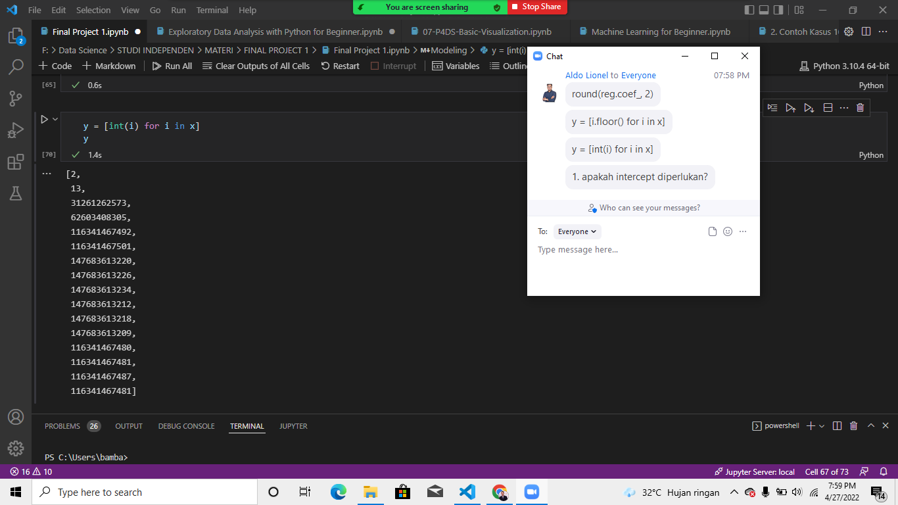

## Gambar

                S2(config)# vlan 10
                S2(config-vlan)# name LAN10
                S2(config-vlan)# exit
                S2(config)# vlan 20
                S2(config-vlan)# name LAN20
                S2(config-vlan)# exit
                S2(config)# vlan 99
                S2(config-vlan)# name Management
                S2(config-vlan)# exit
                S2(config)#
                S2(config)# interface vlan 99
                S2(config-if)# ip add 192.168.99.3 255.255.255.0
                S2(config-if)# no shut
                S2(config-if)# exit
                S2(config)# ip default-gateway 192.168.99.1
                S2(config)# interface fa0/18
                S2(config-if)# switchport mode access
                S2(config-if)# switchport access vlan 20
                S2(config-if)# no shut
                S2(config-if)# exit
                S2(config)# interface fa0/1
                S2(config-if)# switchport mode trunk
                S2(config-if)# no shut
                S2(config-if)# exit
                S2(config-if)# end